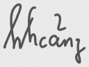
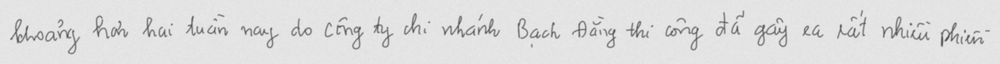
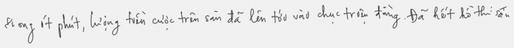
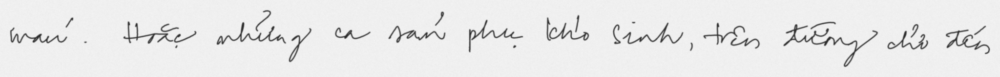

# UIT-HWDB dataset

## Statistic of the dataset

* Our dataset has 5 parts in total:

    * UIT-HWDB-word: [https://drive.google.com/drive/folders/1YYE37ApgxiXOjpm7-mZKq8q472TkvdkA?usp=sharing]()

    * UIT-HWDB-line: [https://drive.google.com/drive/folders/1iM_9PXczXXOrE7Dtw8CuxQeawAuMVRd1?usp=sharing]()

    * UIT-HWDB-paragraph: [https://drive.google.com/drive/folders/1Wf92nNJsz0rVOzefPhvLZscE6xzy9YDf?usp=sharing]()

    * UIT-HWDB-syn-word: [https://drive.google.com/drive/folders/1FNQos8H3KjJqBwjk_R8_E19DfRDE6u3y?usp=sharing]()

    * UIT-HWDB-syn-line: [https://drive.google.com/drive/folders/12zwTYdpzG7yqAMBDpVOKaE-misSCZrqa?usp=sharing]()

## Sample images

* Some examples from the training set of the UIT-HWDB dataset:

    * UIT-HWDB-word:
        |:---:|:---:|
        |||

        |||

    * UIT-HWDB-line:
        |:---:|:---:|
        |||

        |||

    * UIT-HWDB-paragraph:

        

    * UIT-HWDB-syn-word: because of the large amount of the images, this part of the dataset will be uploaded soon.
    
    * UIT-HWDB-syn-line: because of the large amount of the images, this part of the dataset will be uploaded soon.