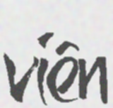
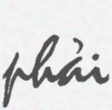
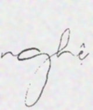
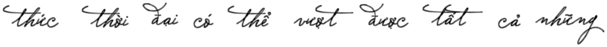
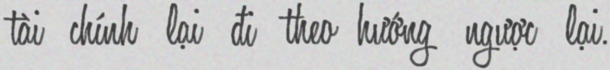
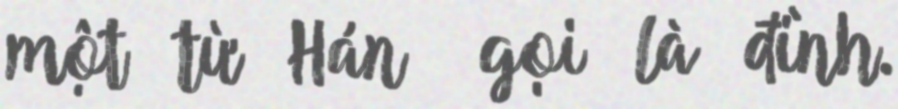
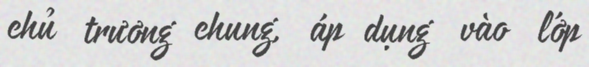

# UIT-HWDB dataset

## Statistic of the dataset

| Dataset | Total |
|:---|:---|
| UIT-HWDB-word | 110,745|
| UIT-HWDB-line | 7,273 |
| UIT-HWDB-paragraph | 1,144 |
<!-- | UIT-HWDB-word-syn | 307,734 |
| UIT-HWDB-line-syn | 36,320 | -->


* Our dataset has 3 parts in total:

    * UIT-HWDB-word: [https://drive.google.com/file/d/1n4sE79un-v8RryydsXun5t_Fq1W4UfXo/view?usp=sharing](https://drive.google.com/file/d/1n4sE79un-v8RryydsXun5t_Fq1W4UfXo/view?usp=sharing)

    * UIT-HWDB-line: [https://drive.google.com/file/d/12JQnvaK_cQ9nfWEaHp9uVyYPJ7tJopBE/view?usp=sharing](https://drive.google.com/file/d/12JQnvaK_cQ9nfWEaHp9uVyYPJ7tJopBE/view?usp=sharing)

    * UIT-HWDB-paragraph: [https://drive.google.com/file/d/1ru17he8OIM0AiTBLrR5_Mnz26NlVWLwU/view?usp=sharing](https://drive.google.com/file/d/1ru17he8OIM0AiTBLrR5_Mnz26NlVWLwU/view?usp=sharing)
<!-- 
    * UIT-HWDB-word-syn: [https://drive.google.com/file/d/1TDpqEZccmbImuHOf6qsxEcF_Os2Kvemb/view?usp=sharing](https://drive.google.com/file/d/1TDpqEZccmbImuHOf6qsxEcF_Os2Kvemb/view?usp=sharing)

    * UIT-HWDB-line-syn: [https://drive.google.com/file/d/1yrZLpQKm7Fwkz0xAE4JgjUqlR11N9m43/view?usp=sharing](https://drive.google.com/file/d/1yrZLpQKm7Fwkz0xAE4JgjUqlR11N9m43/view?usp=sharing) -->


## Sample images

* Some examples from the training set of the UIT-HWDB dataset:

    * UIT-HWDB-word:

         

         

    * UIT-HWDB-line:

         

         

    * UIT-HWDB-paragraph:

        

<!--     * UIT-HWDB-word-syn: 

         

         
    
    * UIT-HWDB-line-syn 

         

          -->

Please cite our study if your work have any information relevant to our dataset:
```
@inproceedings{DBLP:conf/rivf/NguyenVN22,
  author       = {Nghia Hieu Nguyen and
                  Duong T. D. Vo and
                  Kiet Van Nguyen},
  title        = {{UIT-HWDB:} Using Transferring Method to Construct {A} Novel Benchmark
                  for Evaluating Unconstrained Handwriting Image Recognition in Vietnamese},
  booktitle    = {{RIVF} International Conference on Computing and Communication Technologies,
                  {RIVF} 2022, Ho Chi Minh City, Vietnam, December 20-22, 2022},
  pages        = {659--664},
  publisher    = {{IEEE}},
  year         = {2022},
  url          = {https://doi.org/10.1109/RIVF55975.2022.10013898},
  doi          = {10.1109/RIVF55975.2022.10013898},
  timestamp    = {Mon, 30 Jan 2023 14:34:17 +0100},
  biburl       = {https://dblp.org/rec/conf/rivf/NguyenVN22.bib},
  bibsource    = {dblp computer science bibliography, https://dblp.org}
}
```
